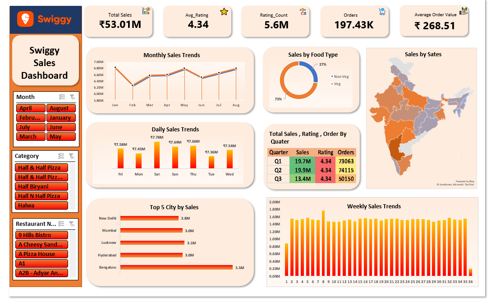

# Exel-ProjectSwiggy 
# Sales Dashboard 📊🍔
# Project Overview

  This project focuses on analyzing Swiggy sales data using Microsoft Excel to generate business insights and build an interactive sales dashboard. The dashboard    helps track sales performance, customer behavior, food category trends, and regional performance.

# Problem Statement

  Businesses generate large amounts of sales data daily, but raw data alone does not provide meaningful insights.
 
 # The goal of this project was to:
  Clean and organize raw sales data
  Analyze sales trends and KPIs
  Create an interactive dashboard for decision-making
# Files Included
  Raw Data File – Contains original Swiggy sales dataset
  Analysis File – Data cleaning, pivot tables, KPI calculations
  Dashboard File – Interactive Excel dashboard with visuals and slicers
# Key Insights
  Total Sales reached ₹53M+
  Average Order Value (AOV) was ₹268.51
  Veg orders contributed the highest share of sales
  Bengaluru generated the highest city-wise sales
  Sales remained relatively stable across weeks and months
  Q2 recorded the highest sales performance
# Tools & Skills Used
  Microsoft Excel
  Pivot Tables & Pivot Charts
  Power Query
  Data Cleaning & Validation
  KPI Cards
  Slicers & Interactive Filters
  Dashboard Design
# Dashboard Features
  Monthly, Weekly & Daily Sales Trends
  State-wise Sales Analysis
  Food Category Distribution
  Top Performing Cities
  Quarter-wise Sales & Orders
  Interactive Filtering with Slicers
# Conclusion

This project demonstrates how raw business data can be transformed into actionable insights using Excel. It improved my skills in data analysis, dashboard design, and business reporting.

Preview

